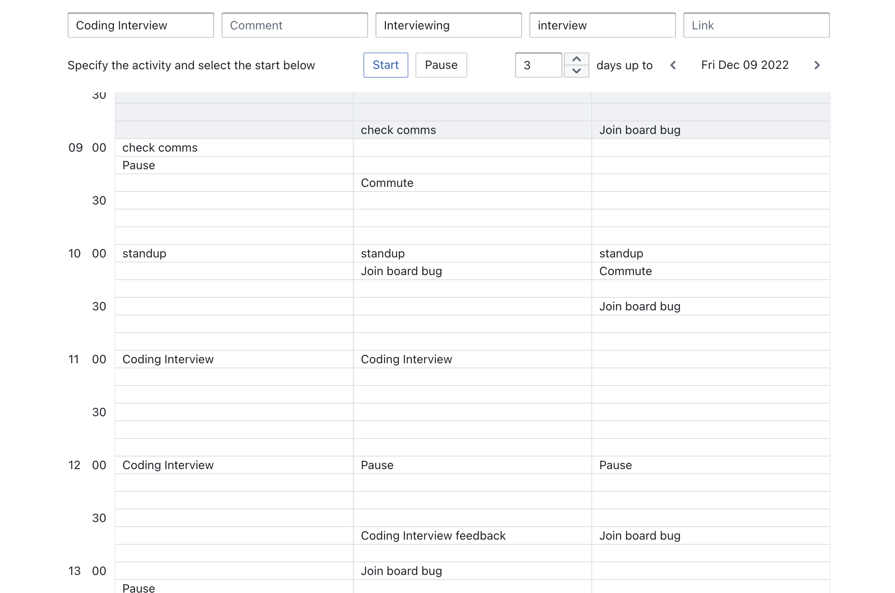
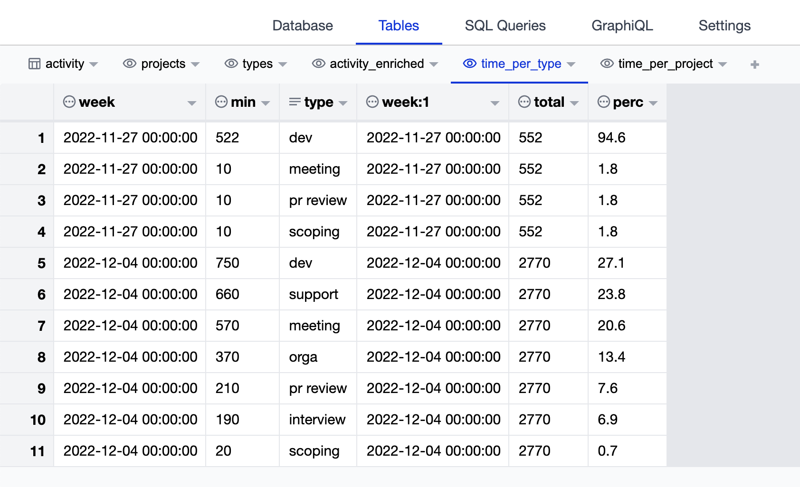

# Task Tracker

This task tracker is built on top of [Airsequel](https://www.airsequel.com/). It relies on one the table and 2 views below.

The design principle for this time tracker is a simple design and fast and frictionless time tracking, so users can enter data with few clicks right when they change tasks. Storing this in an Airsequel / sqlite database makes with data easily available for analysis tools of choice and data can be stored and move wherever it is best. The schema only stores start times, so the whole time line is considered tracked, whereas unproductive time is labelled a special activity called "Pause" in my case.



The UI has the following functionality:
* Selecting a previous entry will populate the form at the top (like copy&paste, this can be considered *resuming* a task)
* Clicking a 10 minute cell will create a task entry with start time of the cell in the DB
* Clicking **Start** will create the activity now
* Clicking **Pause** will create a Pause entry now
* Switching the current day or number of days shown, modifies the calendar view


## Getting Started

```
activity: Table {
    rowid: Integer
    title: Text
    comment: Text
    project: Text
    type: Text
    link: Text
    start: Text
}
```

```sql
CREATE VIEW projects as select distinct project
from activity
where project is not null

CREATE VIEW types as select distinct type
from activity
where type is not null
```

To run this on top of your database, change the following code in `index.tsx`

```javascript
const client = new ApolloClient({
    uri: `http://localhost:4185/dbs/${findGetParameter("db")}/graphql`,
    cache: new InMemoryCache(),
});
```

## Analysis of the data

Using Airsequel's database UI and sqlite queries, the data can easily be analysed. 



Since we only track start times, it is a good idea to create a clean and enriched view of the activity data. The following query computes the end times and duration of tasks and removes unproductive time (Pause).

```sql
CREATE VIEW activity_enriched as select
  *,
  (
    unixepoch(datetime(finish))
    - unixepoch(datetime(start))
  ) / 60 as duration_min
from (
  select
    *,
    lead("start", 1) over (ORDER BY start RANGE BETWEEN UNBOUNDED PRECEDING AND CURRENT ROW) as finish
  from activity
)
where title != "Pause"
```

With this, we can aggregate the share of time per type of activity each week like so:

```sql
CREATE VIEW time_per_type as select
  a.*,
  b.*,
  round(cast(a.min as float) / b.total * 100.0, 1) as perc
from
(
select 
  datetime(start, "weekday 0", "-7 days", "start of day") as week,
  sum(duration_min) as min,
  type
from activity_enriched
group by type, week
) as a
left join
(
select 
  datetime(start, "weekday 0", "-7 days", "start of day") as week,
  sum(duration_min) as total
from activity_enriched
group by week
) as b
USING (week)
order by week asc, min desc, type
```

## Available Scripts

In the project directory, you can run:

### `npm start`

Runs the app in the development mode.\
Open [http://localhost:3000](http://localhost:3000) to view it in your browser.

The page will reload when you make changes.\
You may also see any lint errors in the console.

### `npm run build`

Builds the app for production to the `build` folder.\
It correctly bundles React in production mode and optimizes the build for the best performance.

The build is minified and the filenames include the hashes.\
Your app is ready to be deployed!

See the section about [deployment](https://facebook.github.io/create-react-app/docs/deployment) for more information.
